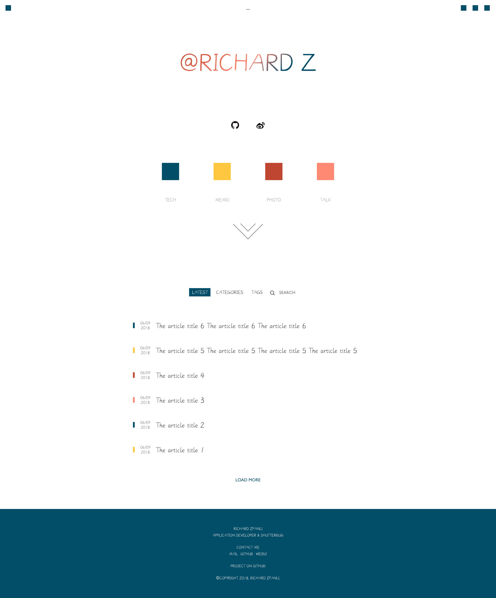

# blog-ui



**Fetch API**

For test:

list: /test/lists.json

article: /test/article.json


## About UI style design

The new style design is almost been finished.

Let's work it out!

## React Router memo

There was a problem.

CSS transition was not working.

It was always unmount and mount when I trigger the active class.

I have spent too much time on attempt to fix it, but I was still no idea about it before today.

It will unmount just because I pass a arrow function to component attribute of Route.

The arrow function will create new component instance every time the state has changed. It cause component unexpectedly unmount.

The solution is just use `render` attribute to instead of `component` for pass props down to target component. Just like pass a render method to replace its own one.

Then, CSS transition is working correctly now!

Powerful `render`!

## I18n memo

Language files are putting in the `\public\locales` folder.

`I18next` use `i18next-xhr-backend` as a backend to load locale files.

There was no way to put locale files in src folder because no option can handle that copy .json file as static assets to build folder(project created by Create-React-App). But I think it's OK, the `public` folder in react is just for do this.

There is another question, the `i18next-browser-languagedetector` module is use to detect user language, but how does it work? Would it return 'zh' when user language is Chinese?

**The Answer**

Just looks like it has done some magical jobs.

We can know how it detect user language from it's documentation.

```
  // order and from where user language should be detected
  order: ['querystring', 'cookie', 'localStorage', 'navigator', 'htmlTag', 'path', 'subdomain'],
```

Query string is not a good choice for me, and cookie or localStorage are for store user language for next time visit our site.

So the primary way we can get user language is use navigator object of browser.

~~But different browser could return different values even it maybe represent the same language.~~

~~For example, I get the values below when I am try to get language with chrome.~~

```
navigator.language
"zh-CN"
```

(Just as I tried, it seems return same values...)

Okay, I have a locale file names `zh` for Chinese, and I have got user language `zh-CN` as above, finally it work correctly.

Nothing to worry about.

## Web Font memo

**There was nothing about web font now but just left it as a memo and will delete when I get time to arrange it.**

Loading a large size font should not let users to be waiting too much.

This css attribute can be help!

`font-display` has few enable values.

- `auto` the user agent will determines how to display font
- `block` block display for a short period, if downloading is not finished, use the default font until it is downloaded
- `swap` block for an extremely small period, and display use default font, swap to web font while download is done
- `fallback` similar to `swap` but only a short swap period, if web font can not be downloaded within swap period, font would not be swapped even download is done after swap period
- `optional` only an extremely small block period, no swap period

This blog use web font as icon, so `swap` is enough, don't let waiting be too long, and ensure the font must be displayed finally.
